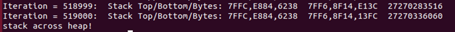
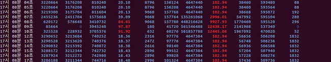
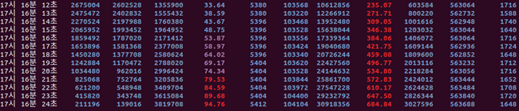
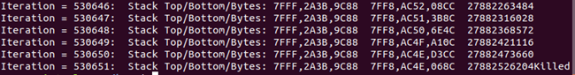
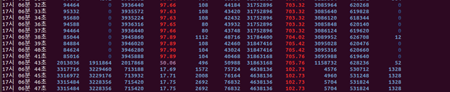
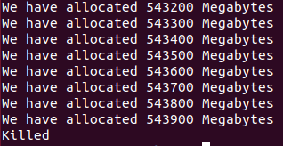

## 프로그램 설명

main()에서 argument로 heap영역에 할당하고자 하는 키그를 megabyte단위로, 그리고 할당한 영역에 대해서는 Write/Read/Nothing
세가지 중 하나의 작업을 명시 하는 문자열 인수로 하여 총 2개의 argument를 받습니다.

Heap영역에 malloc() 함수를 통해 동적 영역을 할당하고, 나머지 남은 영역에 대해서 stack 영역을 할당할 때 stack이 heap역역을 넘어서는
순간을 찾는 프로그램 입니다.

정확한 크기는 찾지 못하였지만, stack을 계속 확장해갈때 kill되는 순간은 확인할 수 있습니다.

## 실행 결과
시스템에서 3.9Gbytes가 가용 가능할때, ./lin 20000 Nothing 을 입력한 경우

## 고찰

우선 가용할 수 있는 전체 메모리 크기에서 heap만 사용할 경우 얼마가 드는지는 아래와 같은 결과가 도출되었습니다.

두번째로 stack만 사용할 때 얼마가 드는지 확인하였습니다.

따라서 구한 크기를 바탕으로, 유한개의 heap을 먼저 할당하고 그 크기를 구한 뒤, stack을 계속해서 증가시키는 경우로 생각하였습니다.
즉, (전체 메모리 크기에서 약간의 여유를 유지한 값 - heap에 할당된 크기) < (stack)일 때 stack이 heap을 만났거나 건너갔다고 
보았습니다.

