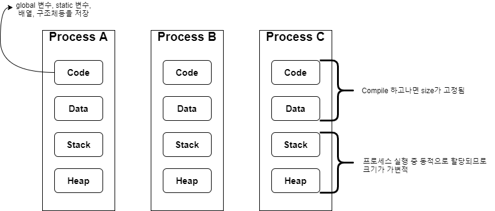

# Process
프로세스는 메모리에 load되어 실행되고 있는 프로그램의 인스턴스를 의미 합니다. 프로세스에 대한 메모리 구조는 아래와 같은데,
	


프로세스는 생성될 때 마다, 또는 동일 프로세스에 대해 fork할 때 마다 각각 전용 code, data, stack, heap영역을 할당 받습니다.

리눅스에서는 fork()함수를 통해 새로운 프로세스를 생성할 수 있습니다. 이 때 부모 프로세스를 fork하게 현재 까지 수행한 상태의 자신(부모)의 프로세스를
복제하여 자식프로세스를 생성하게 됩니다.  

* pid : process identifier로 os가 각 프로세스에게 부여하는 unique한 일련 번호입니다.

* ppid : 부모프로세스의 id 입니다. 어떤 프로세스로 부터 생성이 되었는지를 알려 줍니다.

* pgid : 프로세스가 어느 그룹에 포함되어 있는지에 대한 정보를 알려줍니다. 보통 부모프로세스의 ppid가 pgid가 됩니다.

## 리눅스 프로세서 API 함수들

1. execl(const char*, const char *, ...)
	리눅스에서는 execl()함수를 통해 새로운 프로세스를 실행시킬 수 있습니다.
	단, 이때 아래와 같이 현재 프로세스의 실행 분기를 덮어씌우게 되어, exectest실행 파일이 표시해야할 print문구가 나타나지 않게 됩니다.
	
	```c
	exectest.c
	void main(){
		execl("/home/jun/Desktop/study/targetprocess","/home/jun/Desktop/study/targetprocess" , NULL);
		printf("but this statement will be not printed!\n");
	}
	```
	
	```c
	targetprocess.c
	void main(){
		printf("target process is executed!\n");
	}
	```
	<pre><font color="#8AE234"><b>jun@jun-VirtualBox</b></font>:<font color="#729FCF"><b>~/Desktop/study</b></font>$ ./exectest
	target process is executed!</pre>

2. fork()
	```c
	process_study.c
	void main(){
		pid_t pid;
	
		printf("pid = %u\nppid = %u\n", getpid(), getppid());
		printf("this statement will be executed one time in parent process\n");
		pid = fork();
	
		printf("this execution will be executed twice(pid:%d)\n", pid);
		if(pid == -1)printf("can't create process!\n");

		if(pid > 0){
			printf("parent process fork return value : %u\n", pid);
			printf("parent pid : %d  ppid : %d\n", getpid(), getppid());
			sleep(1);
		}
		else{
			printf("child process fork return value : %u\n", pid);
			printf("childe pid : %d  ppid : %d\n", getpid(), getppid());
			sleep(1);
		}
	}
	```
	
3. wait()
	부모 프로세스와 자식 프로세스 간의 synchronization을 하기 위해 사용됩니다. 자식 프로세스의 실행이 완전히 종료되었는지를 알고자 할 때 사용되는데,
	부모 프로세스에서 자식 프로세스가 완전히 종료되면 부모 프로세스가 종료되게 하여 동기화를 실현할 수 있습니다.
	
<br>
<br>

***

아래 소스코드는 부모 프로세스에서 자식 프로세스를 fork한뒤에 exec()함수를 사용하여, 생성된 자식 프로세스들이 다른 프로세스를 실행하여 덧셈, 뺄셈, 나눗셈, 팩토리얼 계산을
해주는 프로그램 입니다.
프로그램을 실행할 때 "build_mode"라는 문자열을 넘겨주면, 프로세스 id에 대한 자세한 값이 출력되게 됩니다.

### myshell.c

```c
void main(int argc, char* argv[]){	
	pid_t pid;

	pid = fork();
	if((argc == 2) && !strcmp(argv[1], "build_mode")) printf("curren process id(after fork() call) : %d\n", pid);

	if(pid < 0){
		printf("process can't create!, program will be determinated!\n");
		exit(-1);
	}
	else if(pid == 0){
		if((argc == 2) && !strcmp(argv[1], "build_mode")) printf("current process id : %d\n", pid);
		select_prog();
	}
	else{
		wait(NULL);
		if((argc == 2) && !strcmp(argv[1], "build_mode")){
			printf("current process id : %d\n", pid);
			printf("parent process done!\n");
		}

	}
}
```
먼저 exec()함수에 대한 설명글에서 처럼 기존 프로세스(부모 프로세스)에서 다르 프로그램을 실행시키게 되면 현재 코드실행 분기점을 새로운 프로그램, 즉 새로운 프로세스가 덮어씌우게
됩니다. 이는 원래 사용자가 덧셈, 뺄셈, 나눗셈, 팩토리얼을 수행한뒤에 처음 실행했던 프로그램으로 돌아와야 하기 때문에 새로운 자식 프로세스를 생성하여 exec()함수를 실행하게 됩니다.

4번째 라인의 build_mode argument는 main함수의 2번째 인자로서 만약 받게 된다면 프로그램이 실행되는 동안 부모, 자식 프로세스의 상태와 pid를 알려주게 됩니다.

pid == 0이라면 자식 프로세스에서만 실행되므로, 덧셈, 뺄셈, 나눗셈, 팩토리얼을 고르는 select_prog()함수를 호출하게 됩니다. 마지막 else구문은 부모 프로세스에서 분기되는
조건문으로서 wait()함수를 통하여 자식 프로세스가 종료될 때까지 기다리게 됩니다.
<br>
<br>
<br>
<br>

```c
void select_prog(){
	char buf[255];
	char* file_name;
	char* first;
	char* second;

	printf("plz, command line : ");
	scanf(" %[^\n]", buf);
	
	file_name = strtok(buf, " ");
	if(!strcmp(file_name, "./sum") || !strcmp(file_name, "./sub") || !strcmp(file_name, "./div")){
		
		first = strtok(NULL, " ");
		second = strtok(NULL, "\0");

		execl(file_name, file_name, first, second, NULL);
	}
	else if(!strcmp(file_name, "./fact")){
		first = strtok(NULL, "\0");
		execl(file_name, file_name, first, NULL);
		printf("execl error occur!\n");
		exit(-1);
	}
	
	else{
		printf("'%s' is not devised in this program!\n", buf);
		exit(-1);
	}


}
```
사용자로부터 "프로그램명(파일 디렉토리) 첫번째 피연산자 두번째 피연산자(단, 팩토리얼에서는 받지 않음)"를 커맨드 라인으로 받게 되면, token으로 문자열을 분리하여 대응되는 프로그램을 찾습니다.
만약 덧셈, 뺄셈, 나눗셈 중에 하나를 선택했다면, 첫번째 피연산자와 두번째 피연산자를 token으로 분리하여 execl()함수의 파라미터로 넘겨주게 됩니다. 팩토리얼 프로그램 실행에서는, 예기치 
못한 에러가 발생하는 경우와 같이 execl()함수가 정상적으로 실행되지 않을 경우에 대해 에러 문구를 출력한뒤 exit()함수를 호출하여 자식프로세스가 종료되게 하였습니다.
<br>
<br>
<br>
<br>
### 실행 결과

<pre><font color="#8AE234"><b>jun@jun-VirtualBox</b></font>:<font color="#729FCF"><b>~/Desktop/study/process</b></font>$ ./myshell
plz, command line : ./sum 10 6
10 + 6 = 16
<font color="#8AE234"><b>jun@jun-VirtualBox</b></font>:<font color="#729FCF"><b>~/Desktop/study/process</b></font>$ ./myshell
plz, command line : ./sub 23 5
23 - 5 = 18
<font color="#8AE234"><b>jun@jun-VirtualBox</b></font>:<font color="#729FCF"><b>~/Desktop/study/process</b></font>$ ./myshell
plz, command line : ./div 10 3
10 / 3 = 3
10 % 3 = 1
<font color="#8AE234"><b>jun@jun-VirtualBox</b></font>:<font color="#729FCF"><b>~/Desktop/study/process</b></font>$ ./myshell
plz, command line : ./fact 4
4! = 24</pre>
